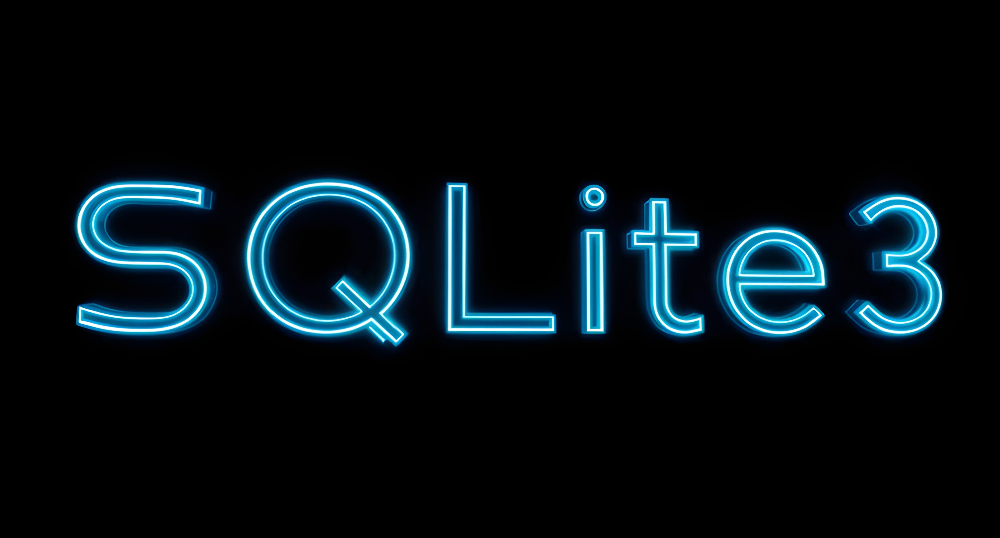

# CATopalian PY sqlite3 Tutorials
Master Python sqlite3 to process massive datasets. From mapping the human genome to managing high-stakes military logistics, learn the essential database skills needed to organize millions of records and advance human technology.

---

---

Welcome to the foundation of massive data management.

Whether you are mapping the 3.2 billion base pairs of the human genome, managing supply chains for a military defense depot, or building the backend for a complex artificial intelligence, data is the architecture of the future.

These tutorials will teach you how to harness **SQLite3**, a lightweight, zero-configuration database engine built directly into Python that is powerful enough to handle Terabytes of information. You will learn how to bypass the limitations of standard arrays and dictionaries to achieve instant, mathematical data lookups.

**Why learn this?**

* **Massive Scale:** Learn to structure, query, and filter millions of records instantly.
* **Real-World Application:** Used heavily in bioinformatics, edge-computing, robotics, and aerospace logistics.
* **Pure Efficiency:** No complex enterprise server installations required, just pure, highly optimized Python scripting.

Complexity is the enemy of efficiency. These tutorials are designed to be clear, grounded, and immediately applicable so you can start building the systems that will advance humanity.

---

### `database_connect_or_create`  
[database_connect_or_create.py](src/tutorials/1.1_database_connect_or_create/database_connect_or_create.py)

[database_connect_or_create.md](src/tutorials/1.1_database_connect_or_create/database_connect_or_create_a.md)

---

### `insert_data`  
[insert_data.py](src/tutorials/1.2_insert_data/insert_data.py)

[insert_data.md](src/tutorials/1.2_insert_data/insert_data_a.md)

---

### `read_data`  
[read_data.py](src/tutorials/1.3_read_data/read_data.py)

[read_data.md](src/tutorials/1.3_read_data/read_data.md)

---

### `update_data`  
[update_data.py](src/tutorials/1.4_update_data/update_data.py)

[update_data.md](src/tutorials/1.4_update_data/update_data_a.md)

---

### How to Download this App
1. **Click** the green **Code Button** on this github page
2. Choose **Download ZIP**
3. **Save** the **Zip File**
4. **Extract All**
5. **Double click** the **README.md file** to open it in VSCode and Click Open Preview on the top right to view the formatted tutorial

---

Happy Scripting :-)

---

// Dedicated to God the Father  
// All Rights Reserved Christopher Andrew Topalian Copyright 2000-2026  
// https://github.com/ChristopherAndrewTopalian  
// https://github.com/ChristopherTopalian  
// https://sites.google.com/view/CollegeOfScripting

